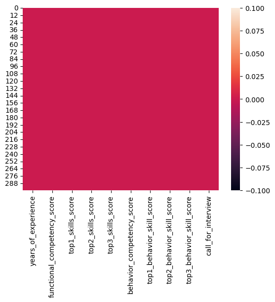
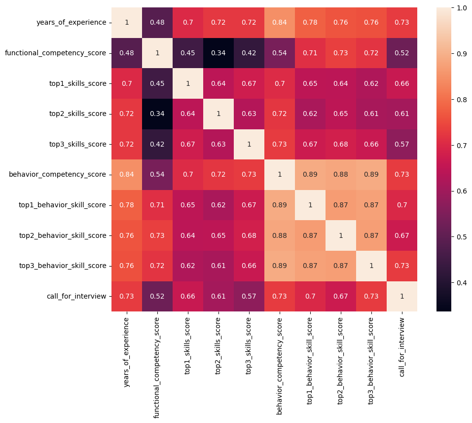
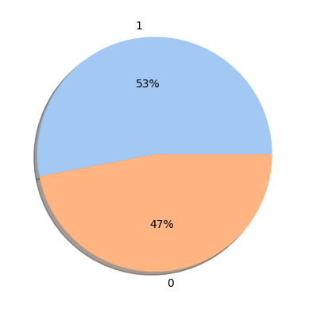

# Laporan Proyek Machine Learning
### Nama : Desintya Frasiska Putri
### Nim : 211351043
### Kelas : Malam B

## Domain Proyek

Rekrutmen dan seleksi kandidat memainkan peran penting dalam menentukan keberhasilan sebuah organisasi. Proses penyaringan awal yang efektif dapat secara signifikan meningkatkan kualitas kumpulan kandidat dan meningkatkan peluang untuk menemukan kandidat yang tepat untuk peran tertentu.

## Business Understanding

Model ini akan mempermudah HR dalam menentukan mana karyawan yang akan lolos ke tahap interview dan mana yang tidak.

Bagian laporan ini mencakup:

### Problem Statements

Menjelaskan pernyataan masalah latar belakang:
- Sulitnya menentukan lolos interview atau tidak jika menggunakan metode manual
- Penilaian HR yang kemungkinan menjadi subjektif bukannya objektif
- Memakan banyak waktu jika ada banyak kandidat dan harus dilakukan pemeriksaan secara manual

### Goals

Menjelaskan tujuan dari pernyataan masalah:
- Mempermudah HR dalam melakukan klasifikasi karyawan lolos interview
- Penilaian menjadi objektif karna otomatis by system sesuai dengan kategori yang di input
- Lebih menghemat waktu dengan adanya sistem

    ### Solution statements
    - Pembuatan aplikasi yang memudahkan HR dalam menentukan karyawan yang lolos interview
    - Model yang di pakai dalam aplikasi tersebut adalah 

## Data Understanding
Dataset yang dipakai diambil dari kaggle yang berisi 300 baris dan 10 kolom, dataset ini berfokus pada skor kompetensi perilaku dan fungsional, yang merupakan aspek penting dari kecocokan dan kontribusi potensial kandidat terhadap organisasi.

[HR Competency Scores for Screening](https://www.kaggle.com/datasets/muhammadjawwadismail/hr-competency-scores-for-screening).

Selanjutnya uraikanlah seluruh variabel atau fitur pada data. Sebagai contoh:  

### Variabel-variabel pada Dataset adalah sebagai berikut:
Dataset ini mencakup 10 fitur:

- years_of_experience - (float64) Jumlah tahun pengalaman yang dimiliki kandidat di bidangnya
- functional_competency_score - (float64) Skor yang mewakili kompetensi fungsional kandidat berdasarkan tes
- top1_skills_score - (float64) Skor dari keterampilan paling berharga yang dimiliki kandidat
- top2_skills_score - (float64) Skor keterampilan paling berharga kedua yang dimiliki kandidat
- top3_skills_score - (float64) Skor dari keterampilan paling berharga ketiga yang dimiliki kandidat
- skor_kompetensi_perilaku - (float64) Skor yang mewakili kompetensi perilaku kandidat yang berasal dari tes SDM
- top1_behavior_skill_score - (float64) Skor dari keterampilan perilaku paling berharga yang dimiliki kandidat
- top2_behavior_skill_score - (float64) Nilai keterampilan perilaku paling berharga kedua yang dimiliki kandidat
- top3_behavior_skill_score - (float64) Skor dari keterampilan perilaku paling berharga ketiga yang dimiliki kandidat
- call_for_interview - (0 atau 1) Variabel biner yang menunjukkan apakah kandidat dipanggil untuk wawancara atau tidak

## Data Preparation
Library yang di pakai adalah:
```
import numpy as np
import pandas as pd
from sklearn.preprocessing import StandardScaler
from sklearn.model_selection import train_test_split
from sklearn import svm
from sklearn.metrics import accuracy_score
import matplotlib.pyplot as plt
import seaborn as sns
```
Import dataset dari kaggle:
pertama kita import token kaggle kita
```
from google.colab import files
files.upload()
```
setelah itu kita buat directorynya
```
!mkdir -p ~/.kaggle
!cp kaggle.json ~/.kaggle/
!chmod 600 ~/.kaggle/kaggle.json
!ls ~/.kaggle
```
lalu kita download dataset dari kagglenya:
```
!kaggle datasets download -d muhammadjawwadismail/hr-competency-scores-for-screening
```
selanjutnya kita extract file tersebut
```
!mkdir hr-competency-scores-for-screening
!unzip hr-competency-scores-for-screening.zip -d hr-competency-scores-for-screening
!ls hr-competency-scores-for-screening
```
terakhir kita panggil datasetnya:
```
df = pd.read_csv('/content/hr-competency-scores-for-screening/dataset.csv')
```
selanjutnya kita cek seperti apa datasetnya dengan cara dibawah ini:
```
df.head()
```

Cek duplikat data:
```
df.duplicated().sum()
```
cek data yang kosong:
```
df.isnull().sum()
```


mari kita cek penyebaran datasetnya:


data calon karyawan yang dipanggil untuk interview sebanyak 53% dan yang tidak di panggil sebanyak 47%:


Tidak ditemukan data yang kosong/null dan semua tipe data sudah sesuai dengan kebutuhan algoritma maka bisa dilanjut ketahap modeling.

## Modeling
1. Menentukan X dan Y
```
X = df.drop (columns='call_for_interview', axis=1)
Y = df['call_for_interview']
```
2. Scaling data
```
scaler = StandardScaler()
scaler.fit(X)
standarized_data = scaler.transform(X)
```
3. Menentukan X dan Y yang sudah di scaling
```
X = standarized_data
Y = df['call_for_interview']
```
4. Memisahkan data training dan testing
```
X_train, X_test, Y_train, Y_test = train_test_split(X, Y, test_size= 0.2, stratify=Y, random_state=2)
```
5. Membuat model
```
classifier = svm.SVC(kernel='linear')
classifier.fit(X_train, Y_train)
```

## Evaluation
Metrik evaluasi yang dipakai adalah metrik akurasi:
```
X_train_prediction = classifier.predict(X_train)
training_data_accuracy = accuracy_score(X_train_prediction, Y_train)
print('Akurasi data training adalah = ', training_data_accuracy)
```
Akurasi data training adalah =  0.9291666666666667

```
X_test_prediction = classifier.predict(X_test)
test_data_accuracy = accuracy_score(X_test_prediction, Y_test)
print('Akurasi data testing adalah = ', test_data_accuracy)
```
Akurasi data testing adalah =  0.9666666666666667

Berdasarkan hasil evaluasi menggunakan metrik evaluasi didapatkan akurasi training sebesar 92% dan testing 96% yang berarti model yang dibuat dapat dipakai karna memiliki tingkat akurasi yang tinggi.

## Deployment
Model yang sudah di buat di deploy menggunakan streamlit:
Link Aplikasi: [Prediksi Interview Kandidat Karyawan](https://klasifikasi-interview-desin.streamlit.app/)

